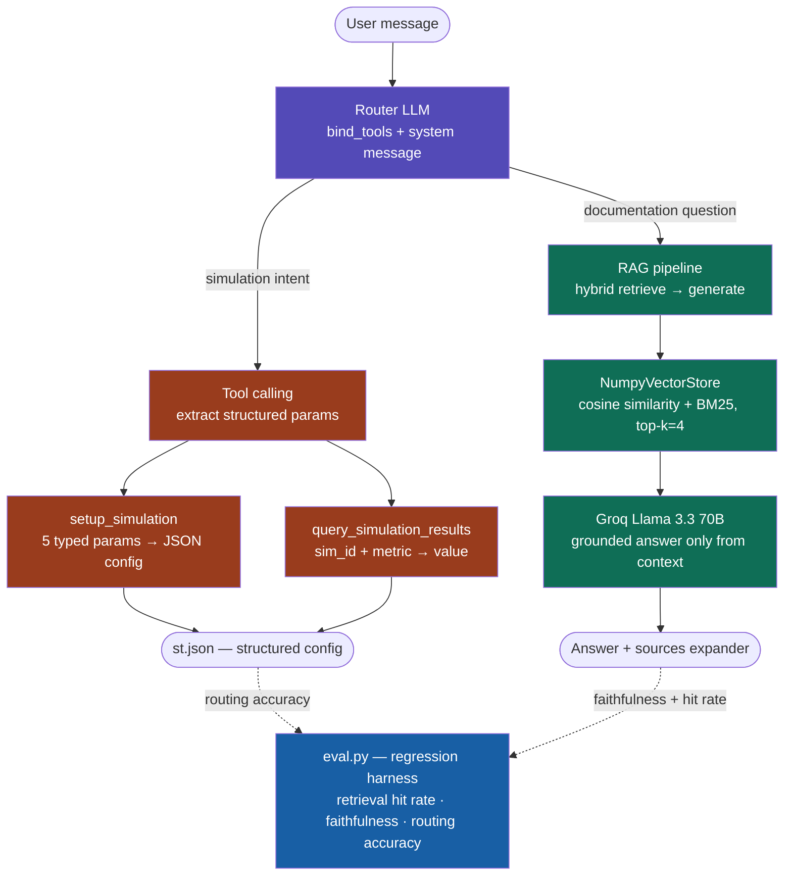

```mermaid
flowchart TD
    A([User message]) --> B

    B[Router LLM\nbind_tools + system message]

    B -->|simulation intent| C[Tool calling\nextract structured params]
    B -->|documentation question| D[RAG pipeline\nhybrid retrieve → generate]

    C --> E[setup_simulation\n5 typed params → JSON config]
    C --> F[query_simulation_results\nsim_id + metric → value]

    E --> G([st.json — structured config])
    F --> G

    D --> H[NumpyVectorStore\ncosine similarity + BM25, top-k=4]
    H --> I[Groq Llama 3.3 70B\ngrounded answer only from context]
    I --> J([Answer + sources expander])

    G -.->|routing accuracy| K[eval.py — regression harness\nretrieval hit rate · faithfulness · routing accuracy]
    J -.->|faithfulness + hit rate| K

    style B fill:#534AB7,color:#fff
    style C fill:#993C1D,color:#fff
    style D fill:#0F6E56,color:#fff
    style E fill:#993C1D,color:#fff
    style F fill:#993C1D,color:#fff
    style H fill:#0F6E56,color:#fff
    style I fill:#0F6E56,color:#fff
    style K fill:#185FA5,color:#fff
```
